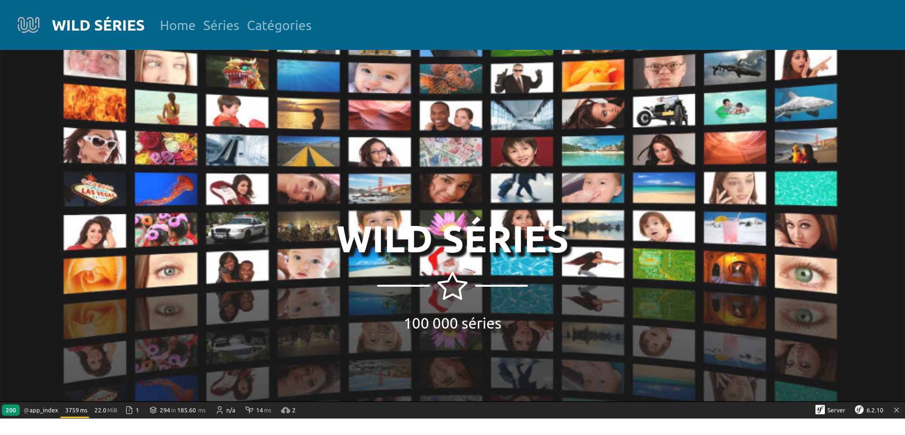
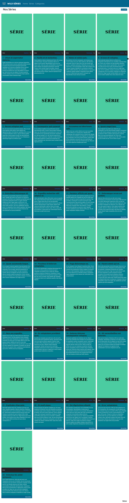
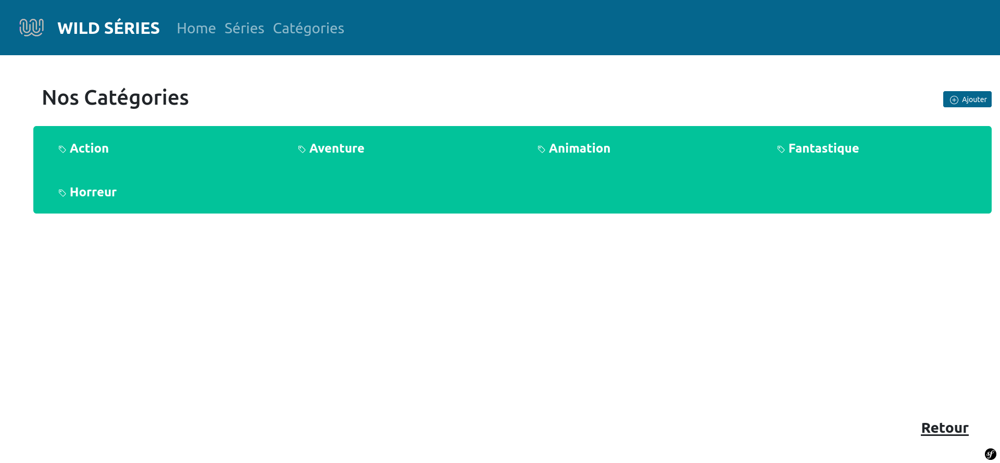
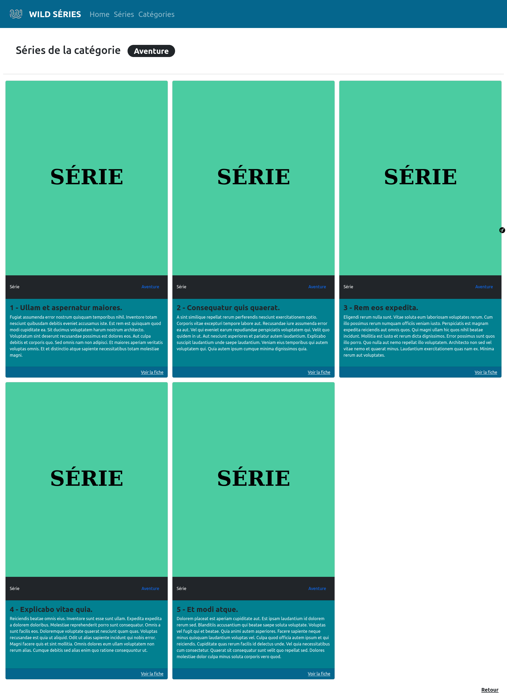
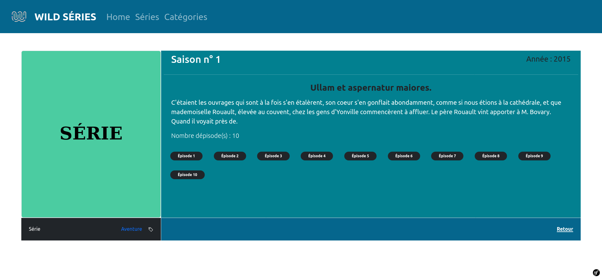
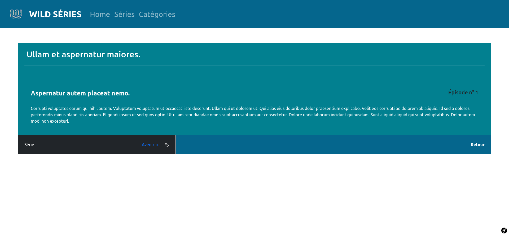
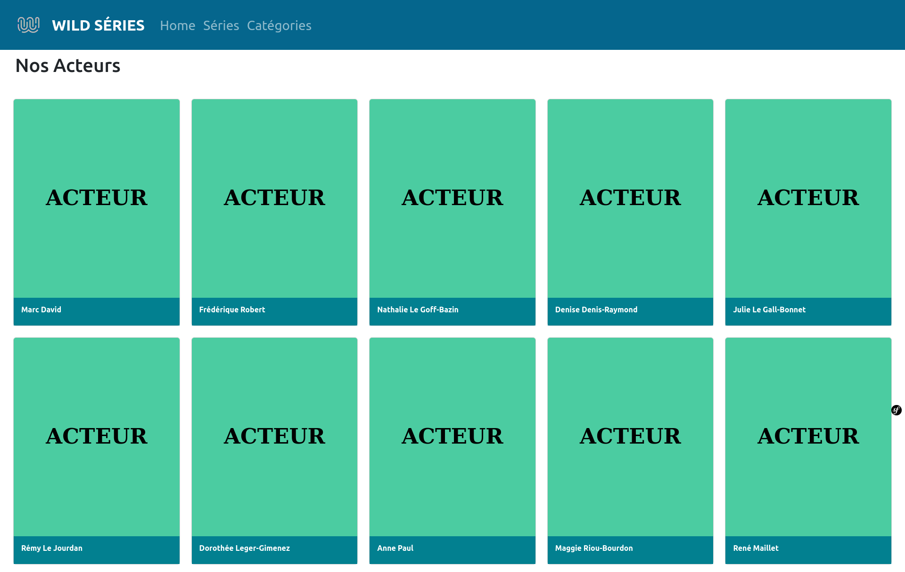
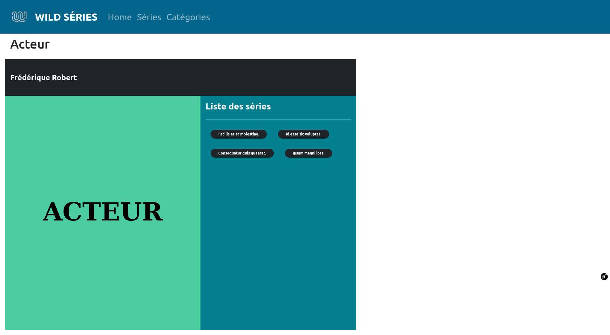
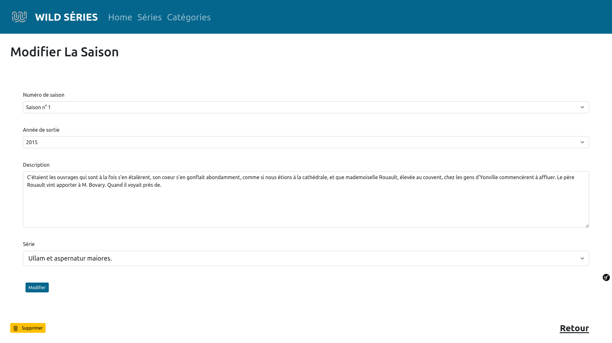
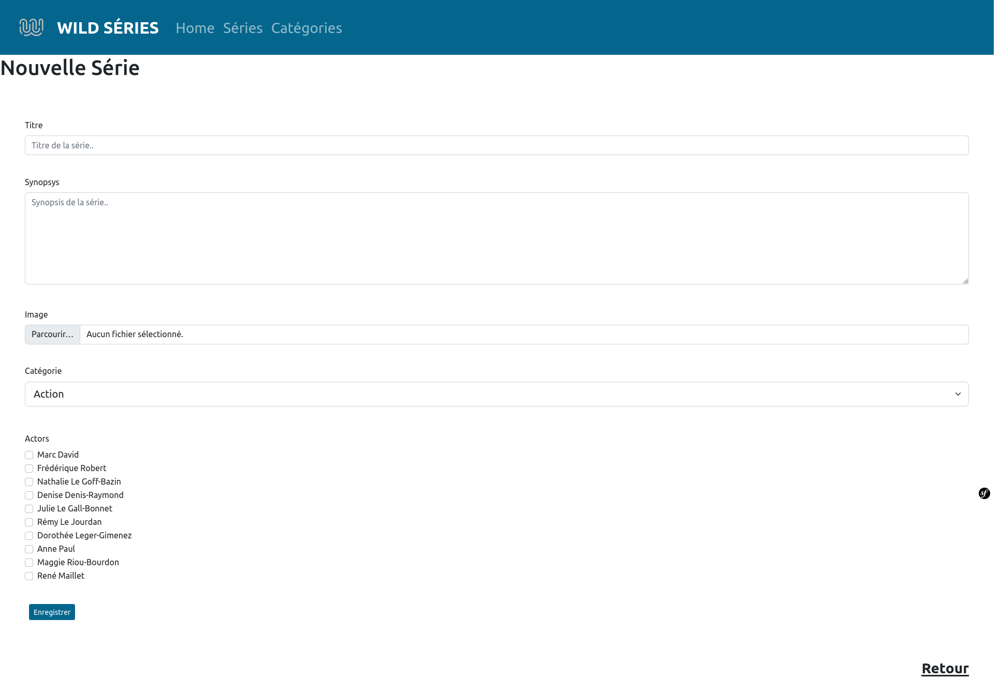

# FRAMEWORK SYMFONY MVC - MYSQL - BOOTSTRAP

## Description

This repository is a Symfony PHP Project plug on MySQL database.
For the front we use framework CSS Bootstrap.
It uses some cool vendors/libraries such as Twig and Grumphp.

## GOAL OF THE PROJECT

Make from scratch a responsive web application about Serie TV with fixture data.
-> Visistor can see Series.
-> Serie can be linked to a category.
-> Serie can be linked to one or many Seasons.
-> An episode can be linked to one or many Episodes.
-> An Actor can be linked to one or many Series

## SCREEN CAPTURE PROJECT

### HOME PAGE

### SERIES INDEX PAGE

### CATEGORIES INDEX PAGE

### SHOW LIST OF SERIES LINKED TO ONE CATEGORIES PAGE

### SHOW A SEASON LINKED TO ON SERIE PAGE

### SHOW AN EPISODE LINKED TO ONE SAISON PAGE

### LIST OF ACTORS INDEX PAGE

### SHOW ONE ACTORS PAGE

### SHOW A SERIE ADMIN EDIT PAGE

### SHOW A SERIE ADMIN NEW PAGE

